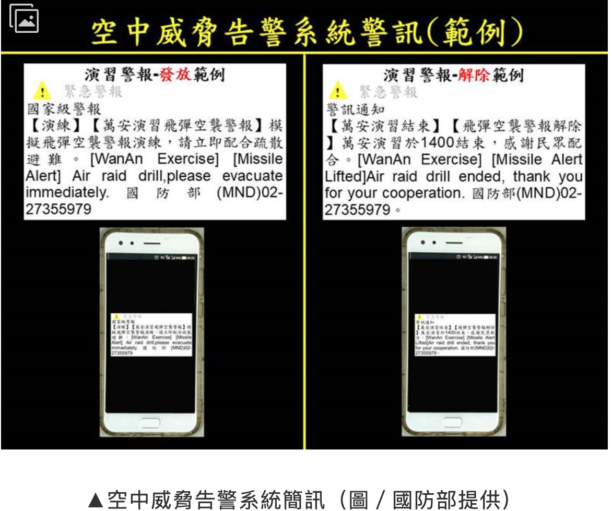

# 第一波攻擊如何保護家人

第一波攻擊

1. Time: 通常48小時以內
    1. 可能會在半夜2-4點
2. 攻擊方式: 主要以火箭和飛彈空襲
3. 一般民眾: 在主要轟炸目標2km以上的地方找遮蔽物掩護

第一波攻擊主要轟炸目標

1. 軍事指揮所
2. 雷達站
3. 軍機場

1. 警報預警: 大概在飛彈落地的3分鐘以前
    1. 根據台灣周邊雷達站偵測飛彈的能力
    2. 原則上,全台手機都會響起
    3. 在3分鐘內躲到地下室或避難處

防空警報聲音:

1.  聽到後要立即避難
2. 當警報響起到結束期間, 避難重點是
    1. 嘴巴微張避免氣胸
        1. 爆炸產生的衝擊波和高氣壓, 即使沒有外傷,可能會使肺部和內臟受傷
    2. 遠離玻璃和窗戶(怕碎掉扎傷)
    3. 尋找遮蔽物
    4. 盡量採低伏臥倒姿勢
    5. 保護肺部和頭部
    6. 暫時關閉手機,不然會影響急救人員的通訊
    
    

    
    [防空警報｜空襲有識嗎｜四招保鎮定](https://youtu.be/rX73dvDfmo0?si=orEKL3IUTINS1g0n&t=38)
    

1. 解除警報:長聲90秒代表防空警報解除

[防空解除警報](https://www.youtube.com/watch?v=MDpXX-XhCjM)

警報響起, 如何在室內保護自己

1. 為避免氣胸,嘴巴要微微張開
2. 遠離窗戶 (避免玻璃破碎割傷
3. 移動到無窗戶的空間(例如浴室)
    1. 離戶外有至少兩道牆的空間,保護力比較強
4. 若劇裡爆炸地點比較近, 請蹲坐或臥倒避免受傷

如何降低爆炸衝擊波對人體的傷害

1. 臥倒, 四足跪姿,蹲坐
2. 不管如何,胸部要抬離地面, 嘴巴微張避免氣胸

何時可以離開屋子

1. 警報解除後,確定有擴音機發出疏散的指示
2. 如果在夜晚發生,盡量等到天亮再行動
3. 天亮時,收拾是先預備好的避難物資和逃生避難所

最安全的室內避難地點是

1. 離外界至少兩道牆, 無窗
2. 有柱子,有水,有食物
3. 基本上就是從屋外手電筒照射看不到的地方

如果警報響起, 仍在戶外

1. 嘴巴微張來避免氣胸
2. 聽從指示疏散到緊急避難所
    1. 例如捷運,地下道,大樓地下室
3. 遠離玻璃帷幕的大樓
4. 避難姿勢: 
    1. 蹲低或趴下 
    2. 但胸部離地
    3. 保護頭部

如果警報響起, 正在開車騎車

1. 嘴巴微張
2. 停靠路邊
3. 躲進地下停車場, 地下道
4. 如果找不到地下避難所,先躲在以熄火的大型車輛下(公車或卡車旁)
5. 姿勢:蹲低臥倒, 胸部離地,保護頭部
6. 等警報結束,去避難所

防空警報解除後, 確認身體是否受傷

1. 受傷通常來自爆炸後的破片
2. 用止血帶避免大量失血
3. 為何從警報響起,到警報結束嘴巴要微張
4. 爆炸產生的衝擊波和高氣壓, 即使沒有外傷,可能會使肺部和內臟受傷
    1. 如果爆炸後後,吸氣時,腹部會劇烈疼痛, 呼吸會咳血,嘴角出現帶血的泡沫,可能是肺部嚴重損傷,需要馬上送醫
    2. 觀察小孩是否有眼角或是耳鼻出血

### Reference:

1. [戰爭下的平民生存手冊：懂這些，才能撐過黃金48小時【關鍵時刻救你，也救家人】(附緊急避難檢查卡)](https://www.books.com.tw/products/0010954819)
2. 新北市教育局防空警報 

[防空警報｜空襲有識嗎｜四招保鎮定](https://www.youtube.com/watch?v=rX73dvDfmo0)
