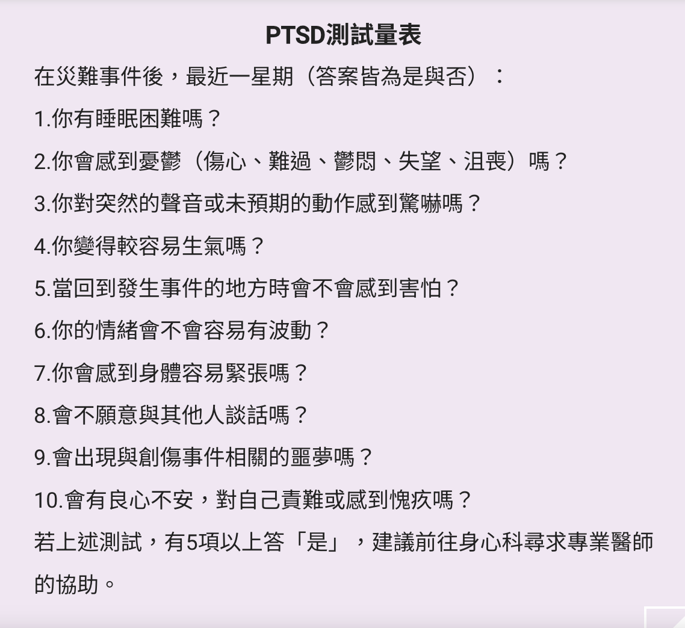

# 終戰

當得知戰爭快結束, 仍然保持警戒狀態

1. 離開避難所之以前,注意用火和周圍是否有爆裂物和不明物提
2. 特別要提醒兒童不要隨便碰處不明物體,因為可能是爆炸物
3. 開始整理物資,財產證明,身分證件
    1. 確保戰後恢復權益的依據
    2. 未用完的物資,先不要丟棄,因為戰後重建還有可能需要用這些物資
4. 回家後請檢查
    1. 附近是否有未爆彈
    2. 檢查樑柱結構是否穩定
    3. 檢查地板
    4. 檢查門窗

戰後可能出現創傷後壓力症候群(PSTD)

1. 親朋好友或自己有可能
2. 症狀
    1. 如果戰後超過一個月,仍有以下以下症狀, 請尋求專業醫療人員的幫助: 
    2. 沒有來由的恐懼感
    3. 恐慌發作導致呼吸變淺而急促
    
    

    
    資料來源
    

    1. [康健雜誌: 創傷後壓力症候群是什麼？PTSD症狀測試、治療解析](https://www.commonhealth.com.tw/article/87453)
