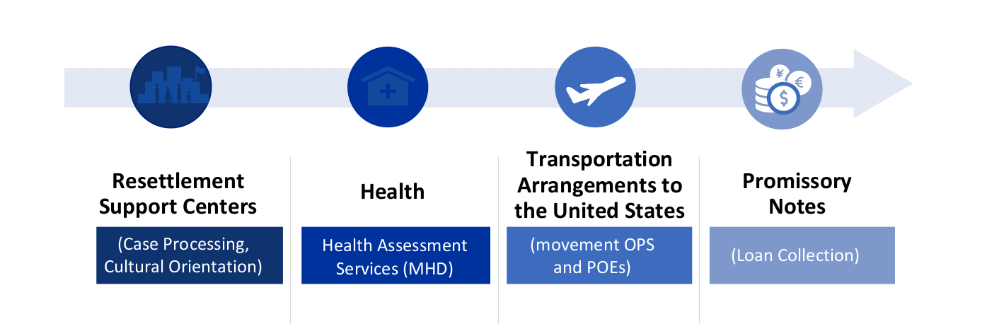
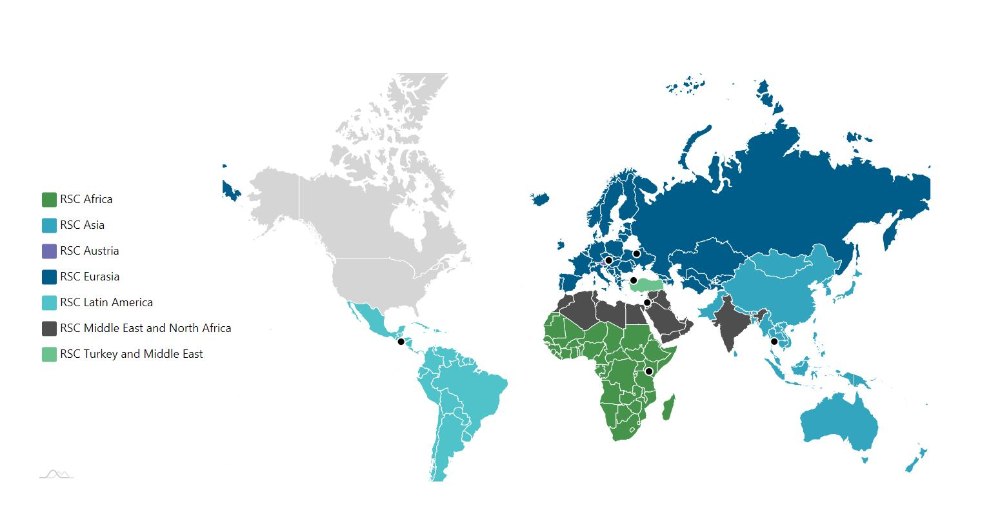

# 美國難民政策

**建議這頁可以cover的內容（要回答的問題）：**

1. 開戰前，看到前兆時：
    1. 簽證：旅遊簽或依親。再申請asylum。
2. 開戰後，
    1. 政府對政府的USRAP Program：台美之間沒有。這是針對有戰爭的國家才可以。「依目前有戰爭的國家，美國的政策和程序是…，但是開戰後，會由政府與政府之間xxx」
        1. Overseas Resettlement Support Centers (RSC) Asia會負責
        2. 政府與政府之間會談判客製化的程序。
        3. 

    2. （待確認的一種模式）民間團體與台灣政府或NGO合作。（也許是一種可以做的Program, e.g. US TW x 某美國難民NGO）
        1. 小規模
        2. 可以接台灣人過來，也協助settlement。但是要有依親資格。
3. 離開台灣本島短期內會有很大的困難，什麼是比較適合的時機？
4. To map: 美國目前的難民政策、程序是什麼？
    1. 要符合什麼樣的條件？哪些國家的人可以來美國？是否有人數限制？
    2. Refugee, asylum seeker, temporary protected status的差別在哪裡？哪個是台灣人可以使用的？
5. 基於美國的「難民政策」，如果開戰，台灣人有符合嗎？
    1. 為什麼沒有？需要台灣與美國之間的協議、國會編預算
    2. 有什麼需要透過來遊說、改變的政策嗎？
        1. 難。因為議題的敏感性。
6. 撇開「看難民身份」，台灣人可以透過什麼簽證選項來到美國？要事先做好什麼準備？
    1. 關鍵是要先看準「開戰前兆」嗎？
    2. 持有各種美國簽證、綠卡、公民的台灣人，可以透過這個關係（連結/依親），把台灣的家人帶到美國嗎？
7. 補充：除了美國，是否有別的國家的難民政策、文化、環境，更適合台灣人移居？
8. 戰爭發生後，美國有那些台美人組織可以接待、協助台灣人？
    1. 可以先跟下面的組織(resettlement負責）先讓他們認識台灣
    

# 台灣人能來美國的簽證選項？

# 美國的難民政策目前有什麼規範？

# 什麼是難民 (refugee)？

> Definition of a Refugee
>  

> The U. S. Refugess Admissions Program (USRAP)
>  

"The U. S. Refugee Admissions Program (USRAP) accepts referrals for refugees determined to be particularly vulnerable and in need of the protection provided by third-country resettlement." 

[https://www.state.gov/refugee-admissions/](https://www.state.gov/refugee-admissions/)

* The USRAP is managed by the [State Department](https://www.cfr.org/backgrounder/how-does-us-refugee-system-work-trump-biden-afghanistan). Since its creation in 1980, it has accepted more than 3 million refugees into the United States.
* The FY 2023 Presidential Determinations on Refugee Admissions is [125, 000 people](https://www.state.gov/refugee-admissions/).
    - Annual numerical ceilings on refugee admissions are proposed by the president and require congressional approval.
* The Refugee Act of 1980 is an amendment to the Immigration Act of 1965 and the Migration and Refuge Assistance Act of 1962.

> USRAP Big Picture
>  

## 7 RSCs to process refugees for resettlement

| **Overseas Resettlement Support Centers** **(RSC)** | Hub |  |
| --- | --- | --- |
| RSC Eurasia | Kyiv, Ukraine | IOM |
| RSC Latin America |  | IOM |
| RSC Mena |  | IOM |
| RSC Africa |  | IOM |
| RSC Asia | headquartered in Thailand, with a sub-office in Malaysia 討論哪裡可以建立camp。設立camp。做background, health assessment。可能會1-2年。 | IRC |
| RSC TuME |  | ICMC |
| RSC Vienna |  | HIAS |

## 9 Resettlement Agencies (RAs) domestically （比較official, 他們會再跟比較草根的組織合作e.g. 同鄉會）

* Church World Service (CWS)
* Episcopal Migration Ministries (EMM)
* Ethiopian Community Development Council (ECDC)
* Hebrew Immigrant Aid Society (HIAS)
* International Rescue Committee (IRC)
* Lutheran Immigration and Refugee Services (LIRS)
* US Committee for Refugees and Immigrants (USCRI)
* United States Conference of Catholic Bishops (USCCB)
* World Relief (WR)

## Refugee Processing Center (RPC) – WRAPS/START

> Refugee Resettlement Process
>  

# 什麼是尋求避難者 (asylum seeker)？
* Asylum seekers follow a different protol than those applying for refugee status.

[https://www.americanimmigrationcouncil.org/research/asylum-united-states](https://www.americanimmigrationcouncil.org/research/asylum-united-states)

旅遊簽三個月後可申請

# 什麼是臨時保護身份 (temporary protected status)？

# Action Items
