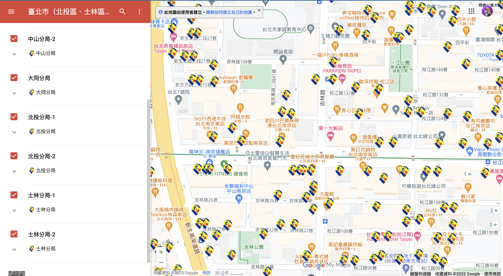

# 認識戰場

# 戰場可能在哪？

重要登陸港口：高雄港、基隆港、台中港、澎湖

會先從佔領東沙群島、馬祖、金門開始

能源會是最缺乏的物資

[路透社 - Battle for Taiwan](https://www.reuters.com/investigates/special-report/taiwan-china-wargames/)

# 物資與供應鏈如何進入台灣？

維持供應鏈運作（這需要軍事專家及物流專家）太專業了一般民眾不會接觸到

戰爭初期不會發生斷糧現象，政府會致力維持民眾生存需求，如有徵用民宅及疏散調度之情勢，依照警政局安排即可。但隨著戰爭發展，物資短缺是非常有可能的現象，因此維持供應鏈運作是重要的、需要事先規劃的。

# 防空洞資訊

內政部警政署民防指揮管制所： [https://adr.npa.gov.tw/](https://adr.npa.gov.tw/)

[災難救援課程](災難救援課程.md)
