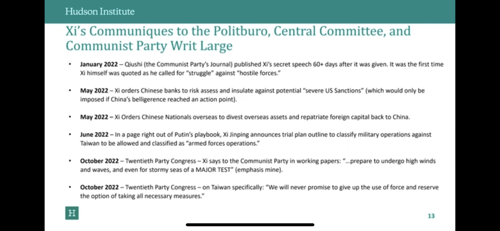
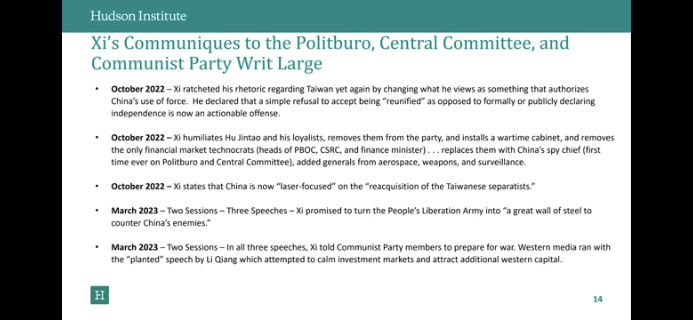
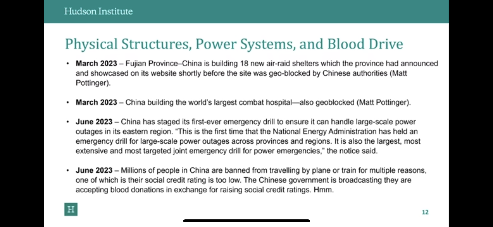
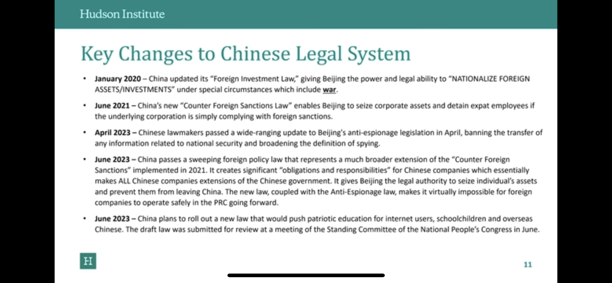

# 開戰前的徵兆與準備

# 開戰前的徵兆

## 1. 經濟：異常金流

過去五年中國在減少美國國債時，一方面可能會加速與美元脫鉤；開戰前，中國可能也會快速減少海外資產，造成兩岸間的貿易與金流會開始有異常現象。例如：

1. 實施更有力的跨境資本控制，包括對精英階層明顯的資本外逃(capital flight)作出反應。
2. 凍結中國境內的外國金融資產。
3. 迅速清算和歸還中國的海外資產，包括出售美國債券。
4. 猛烈囤積緊急物資，如藥品或關鍵技術投入。
5. 暫停關鍵的出口產品，如關鍵礦物、精煉石油產品或食品。
6. 採取措施減少需求或配給關鍵商品，特別是石油和天然氣等進口商品。
7. 優先考慮或改變軍事生產的關鍵投入的方向。
8. 限制中國精英或重要人員的出境旅行。
9. 要求國家單位減少使用外國軟體。

資料來源: [風傳媒](https://www.storm.mg/lifestyle/4788206?page=1), [Carnegie Endowment for International Peace](https://carnegieendowment.org/2022/10/03/how-we-would-know-when-china-is-preparing-to-invade-taiwan-pub-88053)

## 3. 交通：大規模更改或取消交通運輸

❗️大規模更改或取消列車、航運、航班

❗️大量物資調動或運輸頻繁可能意味著兵力調動和後勤物資需求超過平時。

❗️在大規模軍事行動前，通常會有空中禁航宣告以避免誤擊第三國民航機。民眾可從民航局或航空公司公告獲知禁航消息。

資料來源: [風傳媒](https://www.storm.mg/lifestyle/4788206?page=1)

內容／圖轉載自野人文化[《戰爭下的平民生存手冊：懂這些，才能撐過黃金48小時【關鍵時刻救你，也救家人】(附緊急避難檢查卡)》](https://www.books.com.tw/products/0010954819?utm_source=stormmediagroup&utm_medium=ap-books&utm_content=recommend&utm_campaign=ap-202305)

## 4. 軍事：發動演習

「軍事演習」常被用作隱藏真實軍事目的的名義，歷史上許多戰爭都以此開始。當任何一方宣布「軍事演習」開始，可能意味著進入談判或外交的最後階段。演習的規模和動態顯示了戰爭的初始軍事力量，也有展示軍事和國家實力的意義。觀察大規模軍演的政治效果和官方的實際行為，而非僅看表面的宣傳或外交辭令，對於判斷戰爭的可能性至關重要。

資料來源: [風傳媒](https://www.storm.mg/lifestyle/4788206?page=1)

## 5. 外交 ：各國撤僑或中斷溝通管道

當外國駐外機構開始撤僑準備或發布旅遊警示時，我們應提高警覺，因為事態可能迅速升溫或朝向不可逆的方向轉變。例如：中斷溝通管道，例如海基會與海協會關閉對話的管道；雙方辦事處工作人員開始撤出，日常業務辦理和資訊交流無預警中斷。或是找不到駐外機關承辦人員

資料來源: [風傳媒](https://www.storm.mg/lifestyle/4788206?page=1)

> [美國國務院 - 旅遊資訊網站](https://travel.state.gov/content/travel/en/international-travel/International-Travel-Country-Information-Pages/Taiwan.html) → 查詢即時更新的資訊
>  

Hudson Institute： 中國已經在為可為的戰爭做準備：

[China Prepares for War: A Timeline](https://www.youtube.com/live/98kMSEkPiLo?si=XJPmjOuOX5SehojA)

 

# 徵兆發生了怎麼幫助在台親友？

[斷網前要下載的App](斷網前要下載的App/index.md)

[準備緊急避難包(清單)](準備緊急避難包清單/index.md)

[找好緊急會合地點](找好緊急會合地點/index.md)

[提前下載或影印全民國防手冊](提前下載或影印全民國防手冊/index.md)

[即時追蹤美國國務院資訊](即時追蹤美國國務院資訊.md)

[#事先準備的物資清單](事先準備的物資清單/index.md)

# Reference
1. [風傳媒: **台海戰爭爆發前，會有哪些徵兆？軍事專家曝「5大信號」：出現就該提前撤離**](https://www.storm.mg/lifestyle/4788206?page=1)
2. 內容／圖轉載自野人文化[《戰爭下的平民生存手冊：懂這些，才能撐過黃金48小時【關鍵時刻救你，也救家人】(附緊急避難檢查卡)》](https://www.books.com.tw/products/0010954819?utm_source=stormmediagroup&utm_medium=ap-books&utm_content=recommend&utm_campaign=ap-202305)
3.  [劉致昕: 烏克蘭的不可能戰爭：反抗，所以存在](https://www.books.com.tw/products/0010930300)
4. [Carnegie Endowment for International Peace:  How We Would Know When China Is Preparing to Invade](http://carnegieendowment.org/2022/10/03/how-we-would-know-when-china-is-preparing-to-invade-taiwan-pub-88053#:~:text=As) 
5. [Center for Strategic and International Studies (CSIS); Economic Indicators of Chinese Military Action against Taiwan](https://www.csis.org/analysis/economic-indicators-chinese-military-action-against-taiwan)  
6. [國防部全民國防應變手冊](https://aodm.mnd.gov.tw/UFile/down/69_2023061309580101_%E5%85%A8%E6%B0%91%E5%9C%8B%E9%98%B2%E6%87%89%E8%AE%8A%E6%89%8B%E5%86%8A.pdf)
7. [Economist: Could economic indicators give an early warning of a war over Taiwan?](https://www.economist.com/china/2023/07/27/could-economic-indicators-signal-chinas-intent-to-go-to-war?fbclid=IwAR2QTRmxneWmTJ6nVEfp6vAs1TYLFtGkuEej4O2FJPT4WSvxpDjoLeBewjQ)
8. [全民防災e點通](https://bear.emic.gov.tw/MY/#/home/account/safeMessage)
