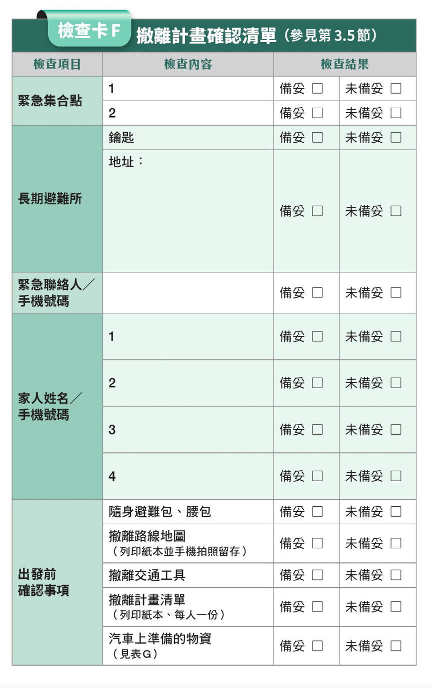

# 找好緊急會合地點

用google map找避難處所

[內政部警政署防空疏散避難專區](https://adr.npa.gov.tw/)

當戰爭發生時，可能因通訊中斷無法與家人即時聯繫，
並因擔心家人安危而著急，

1. 平時可與家人討論約定緊急會合地點：
    1. 建議戰前親自至少到該地探勘
        1. 確定入口
        2. 是否對外開放
        3. 開放時間是否有限制
        4. 有些私有避難所(如住家大樓)不會對外開放
        5. 遠離軍事設施,中央政府部會,油料儲槽,通訊設施
        6. 地下捷運站是很好選擇,但是深夜後會拉下鐵門
    2. 與家人確定災害或戰爭發生後的緊急會合地點，例如：
    附近防空避難處所、醫院、學校、公園等，可至「全
    民防災 e 點通 ([https://bear.emic.gov.tw/](https://bear.emic.gov.tw/))」查詢 ( 網頁
    有無障礙格式，可供身心障礙者查詢 )。
    
    [事先繪製撤離地圖](事先繪製撤離地圖/index.md)
    
    

1. 如發生失聯狀況，可於通訊未中斷或已修復時利用「消
防防災 e 點通 App」的防災卡及親友協尋功能，與親
友保持聯繫：
2. 
(1) 防災卡：提供家庭、社區、學校及企業等群組功
能，紀錄經群組成員討論後的緊急會合地點及避難
收容所；可將成員設定為緊急聯絡人，並可於災害
發生時，發送通知及訊息，更可讓群組成員於有網
路通訊時回報是否平安及位置等訊息。

    

    
    (2) 親友協尋：另若與親友失聯，可使用親友協尋功能，
    於系統建立親友資料，將自動比對災害應變中心的
    傷亡名冊資料、撤離或收容名冊等，待有相符之人
    員，即會自動通知。
    
    當有重大災難發生，想要讓心愛的家人在第一時間知道自己平安，系統已預設文字，讓您可以快速傳送訊息給家人[**親友](https://social-plugins.line.me/lineit/share?url=&text=%E7%A8%8D%E4%BE%86%E7%9A%84%E5%B9%B3%E5%AE%89%E8%A8%8A%E6%81%AF!%0A%E6%88%91%E7%8F%BE%E5%9C%A8%E5%9C%A8%E8%87%BA%E5%8C%97%E5%B8%82%E4%B8%AD%E6%AD%A3%E5%8D%80%EF%BC%8C%E5%9D%90%E6%A8%99%E7%B6%93%E5%BA%A6%EF%BC%9A121.511955%E7%B7%AF%E5%BA%A625.040083%EF%BC%8C%E7%9B%AE%E5%89%8D%E5%B9%B3%E5%AE%89%EF%BC%81%0Ahttp%3A%2F%2Fmaps.apple.com%2F%3Faddress%3D%E8%87%BA%E5%8C%97%E5%B8%82%E4%B8%AD%E6%AD%A3%E5%8D%80%26li%3D121.5119547%2C25.0400826%2C10z&from=line_scheme)[e-mail](mailto:%20?subject=%E7%A8%8D%E4%BE%86%E7%9A%84%E5%B9%B3%E5%AE%89%E8%A8%8A%E6%81%AF&body=%E6%88%91%E7%8F%BE%E5%9C%A8%E5%9C%A8%E8%87%BA%E5%8C%97%E5%B8%82%E4%B8%AD%E6%AD%A3%E5%8D%80%EF%BC%8C%E5%9D%90%E6%A8%99%E7%B6%93%E5%BA%A6%EF%BC%9A121.511955%E7%B7%AF%E5%BA%A625.040083%EF%BC%8C%E7%9B%AE%E5%89%8D%E5%B9%B3%E5%AE%89%EF%BC%81)** [(聯絡網站)](https://bear.emic.gov.tw/MY/#/home/account/safeMessage)
    
    

    

App下載連結:

[消防防災e點通](https://apps.apple.com/us/app/消防防災e點通/id1500403641?ign-itscg=30200&ign-itsct=apps_box_badge)

[消防防災e點通 - Google Play 應用程式](https://play.google.com/store/apps/details?id=com.nfa.report&hl=zh_TW&gl=US&pcampaignid=pcampaignidMKT-Other-global-all-co-prtnr-py-PartBadge-Mar2515-1)

Reference:

1. 內容／圖轉載自野人文化[《戰爭下的平民生存手冊：懂這些，才能撐過黃金48小時【關鍵時刻救你，也救家人】(附緊急避難檢查卡)》](https://www.books.com.tw/products/0010954819?utm_source=stormmediagroup&utm_medium=ap-books&utm_content=recommend&utm_campaign=ap-202305)

