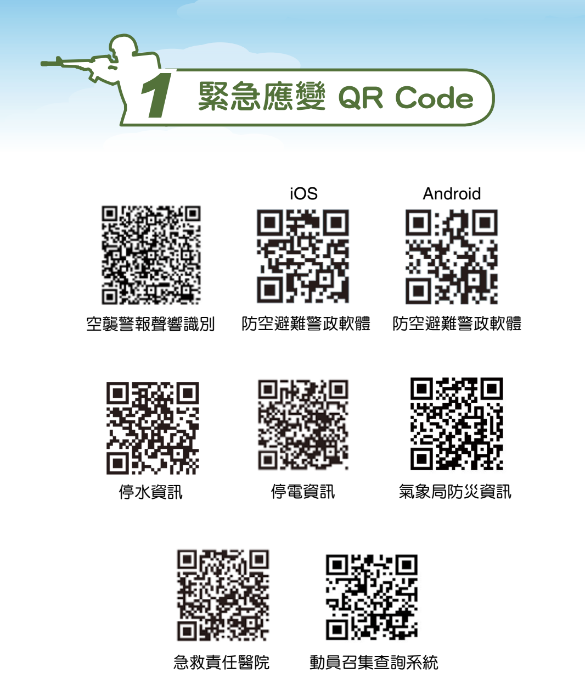

# 提前下載或影印全民國防手冊

因為戰爭期間常常沒有網路, 請提早影印放在急難包或是下載到手機或電腦裡

# 手冊功用

主要是提供民眾面臨戰爭景況下，各種可能發生嚴峻災變時所需之緊急應變資訊以做好生存自助。

[全民國防應變手冊.pdf](https://adma.mnd.gov.tw/files/web/191/file_up/100004/60/%E5%85%A8%E6%B0%91%E5%9C%8B%E9%98%B2%E6%87%89%E8%AE%8A%E6%89%8B%E5%86%8A.pdf)

此手冊為國防部編輯, 主要是提供民眾面臨軍事危機及可能發生之災變時緊急應變資訊，
以做好生存自助。

