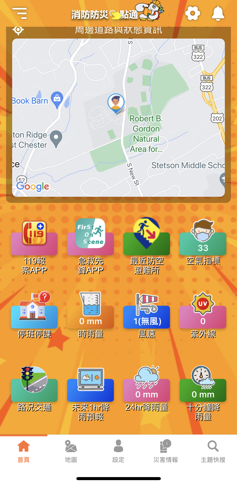
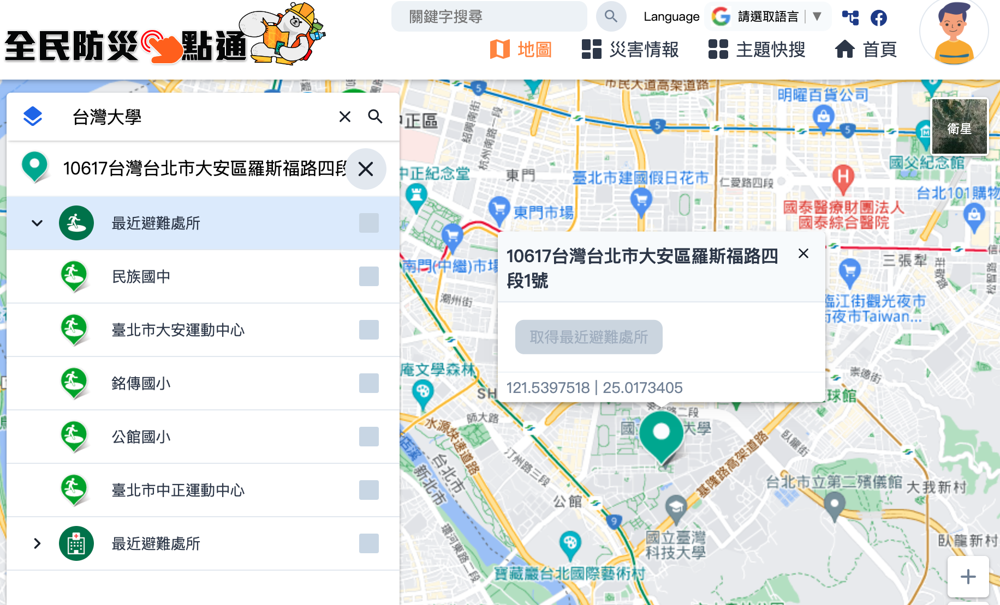

# 斷網前要下載的App

### 1. 提醒親友下載：[「消防防災 e 點通 App」](https://bear.emic.gov.tw/MY/#/home/index)的防災卡、 [親友協尋功能](https://bear.emic.gov.tw/MY/#/home/account/safeMessage)

[消防防災e點通](https://apps.apple.com/us/app/消防防災e點通/id1500403641?ign-itscg=30200&ign-itsct=apps_box_badge)

[消防防災e點通 - Google Play 應用程式](https://play.google.com/store/apps/details?id=com.nfa.report&hl=zh_TW&gl=US&pcampaignid=pcampaignidMKT-Other-global-all-co-prtnr-py-PartBadge-Mar2515-1)

### 2.  幫親友提早找到[避難處所地點](https://bear.emic.gov.tw/MY/#/home/map)、與親友約定緊急會合地點

[內政部警政署防空疏散避難專區](https://adr.npa.gov.tw/)

# 3. 斷網時仍可互傳訊息的App

[下載斷網時仍可互傳訊息的app ](下載斷網時仍可互傳訊息的app/index.md)

[如何下載和使用](https://www.hk01.com/%E5%AF%A6%E7%94%A8%E6%95%99%E5%AD%B8/385884/%E6%96%B7%E7%B6%B2%E5%BF%85%E5%82%99-%E7%9B%A4%E9%BB%9E5%E5%A4%A7%E9%80%9A%E8%A8%8A%E7%A5%9Eapp-%E9%82%8A%E6%AC%BE%E6%9C%80%E5%A5%BD%E7%94%A8)

戰爭時期, 網路通訊設備和基地台會是最先被轟炸的目標

幫助親友在戰前就下載可以在無網路環境下, 仍然能通訊的app 

甚至先教導好他們如何使用
以及建立家族或社區互助群組
