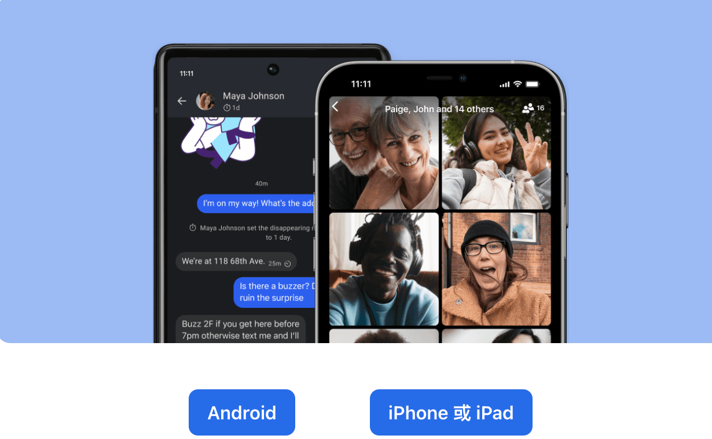

# 下載斷網時仍可互傳訊息的app

[如何下載和使用](https://www.hk01.com/%E5%AF%A6%E7%94%A8%E6%95%99%E5%AD%B8/385884/%E6%96%B7%E7%B6%B2%E5%BF%85%E5%82%99-%E7%9B%A4%E9%BB%9E5%E5%A4%A7%E9%80%9A%E8%A8%8A%E7%A5%9Eapp-%E9%82%8A%E6%AC%BE%E6%9C%80%E5%A5%BD%E7%94%A8)

戰爭時期, 網路通訊設備和基地台會是最先被轟炸的目標
為了維持親友間的聯繫, 

幫助親友在戰前就下載可以在無網路環境下, 仍然能通訊的app 

甚至先教導好他們如何使用, 以及建立家族或社區互助群組

1. Signal:

如何使用[教學](https://hk.gordonchoi.com/signal-guide/)

[下載app](https://signal.org/zh_TW/download/) 

利用Wi-Fi直連技術，可在100米內通信，優點是數據傳輸率有250 mbps，適用於分享容量較大檔案，例如影片等。

1. Bridgefy 
(有時候訊號不穩定)

**Android版：[按此](https://play.google.com/store/apps/details?id=me.bridgefy.main)**

**iOS版：[按此](https://apps.apple.com/us/app/bridgefy/id975776347)**

可以利用藍牙功能，讓手機與手機在100米範圍內通訊，故沒有網絡下仍可互傳訊息。

Bridgefy亦可以利用每一台已安裝Bridgefy的手機組成MESH網絡，即在沒有數據連線（連Wi-Fi都沒有）下，把另一名Bridgefy當成「中間點」，藉此擴大Bridgefy用戶間連線距離至100米外。不過大家可以放心，訊息會以保密狀態傳播，「中間點」用戶無法閱覽訊息。

參考資料：

 1. 【斷網必備】無網絡都可互傳訊息　盤點5大通訊神App | 香港01 [https://www.hk01.com/article/385884?utm_source=01articlecopy&utm_medium=referral](https://www.hk01.com/article/385884?utm_source=01articlecopy&utm_medium=referral)

1. [**SIGNAL 教學**](https://hk.gordonchoi.com/signal-guide/)
