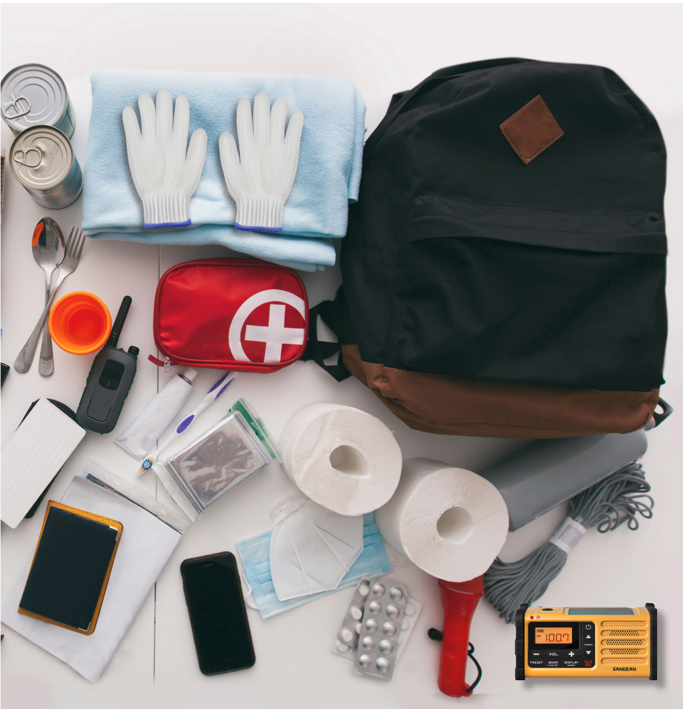

# 準備緊急避難包(清單)

## 可以透過網購, 幫台灣的親友緊急避難包

1. 可以事先提醒親友開始準備,以免戰前恐慌,大賣場物品會被掃空
2. 幫親友在網路上網購( 蝦皮, 東森….) 
3. 參考資料: [戰爭下的平民生存手冊：懂這些，才能撐過黃金48小時【關鍵時刻救你，也救家人】(附緊急避難檢查卡)](https://www.books.com.tw/products/0010954819)

[黑熊學院推薦避難裝備](https://kuma-academy.org/events-article-evacuation-planning/)

### ( 一 ) 個人緊急避難包

[轉自全民國防應變手冊 pg 9](https://aodm.mnd.gov.tw/UFile/down/69_2023061309580101_%E5%85%A8%E6%B0%91%E5%9C%8B%E9%98%B2%E6%87%89%E8%AE%8A%E6%89%8B%E5%86%8A.pdf)

當戰爭發生時，緊急避難包是個人臨時避難，可立即隨身揹行攜帶之必備物資 ( 例如：前往防空避難處所 )，有助維持生存基本需求。平時即完成避難包準備，內容可依個人需求調整，建議如下：

1. 必備
□  背包
□  個人所需2天內適量飲食 ( 水、食物【如罐頭, 能量棒等高熱量不佔體積的食物)
□ 耐用的水壺 
□ 手電筒 ( 含電池 )
□ 重要證件影本 +防水袋( 身分證、戶口名簿、健保卡, 護照)
□ 個人醫療用品 ( 慢性病用藥、急救用藥、處方箋影本 )
□ 粗棉手套
□ 哨子
□ 簡易求生工具 ( 如小刀、開罐器、鋼製杯碗等 ）
□ 全民國防手冊
□ 手機

[□ 保暖用品 ( 如睡袋、毛毯或禦寒衣物 ](□%20保暖用品%20(%20如睡袋、毛毯或禦寒衣物.md)

[□ 個人醫療急救卡 (血型, 緊急聯絡人, 過敏, 疾病)](□%20個人醫療急救卡%20血型緊急聯絡人過敏疾病/index.md)

1. 其他
□ 清潔用品 ( 衛生紙、濕紙巾、毛巾 )
□ 小面額紙鈔和零錢(不用花時間找錢)
□ 行動電源 ( 充飽電 )
□ 輕便雨衣
□ 嬰幼兒尿布、奶粉、奶瓶等
□ 成人或女性生理用品
□ 備份鑰匙
□ 寵物乾糧

[清潔用品 ( 衛生紙、濕紙巾、毛巾 )](清潔用品衛生紙濕紙巾毛巾/index.md)

### ( 二 ) 家庭必備物資準備

若暫時於家中避難，可能遭遇停水停電、糧食短缺情形，可比照緊急避難包內容做好下列準備：
□ 3 日份以上的食物及飲水
□ 小型、手搖式發電機、備用電源或太陽能充電板
□ 行動電源, 充電線, 電池, 行動是太陽能板
□ 無線電對講機(讓家族彼此溝通)

□ 重要文件 (房契, 房契, 駕照, 行車執照…)
□ 收音機 ( 太陽能或是手搖式發電最好, 要有FM +AM)

[藥物](藥物/index.md)

[急救箱](急救箱/index.md)

[瑞士刀](瑞士刀/index.md)

### Reference

1. [全民國防應變手冊](https://aodm.mnd.gov.tw/UFile/down/69_2023061309580101_%E5%85%A8%E6%B0%91%E5%9C%8B%E9%98%B2%E6%87%89%E8%AE%8A%E6%89%8B%E5%86%8A.pdf) 
2. [黑熊學院推薦避難裝備](https://kuma-academy.org/events-article-evacuation-planning/)
3. [戰爭下的平民生存手冊：懂這些，才能撐過黃金48小時【關鍵時刻救你，也救家人】(附緊急避難檢查卡)](https://www.books.com.tw/products/0010954819)
